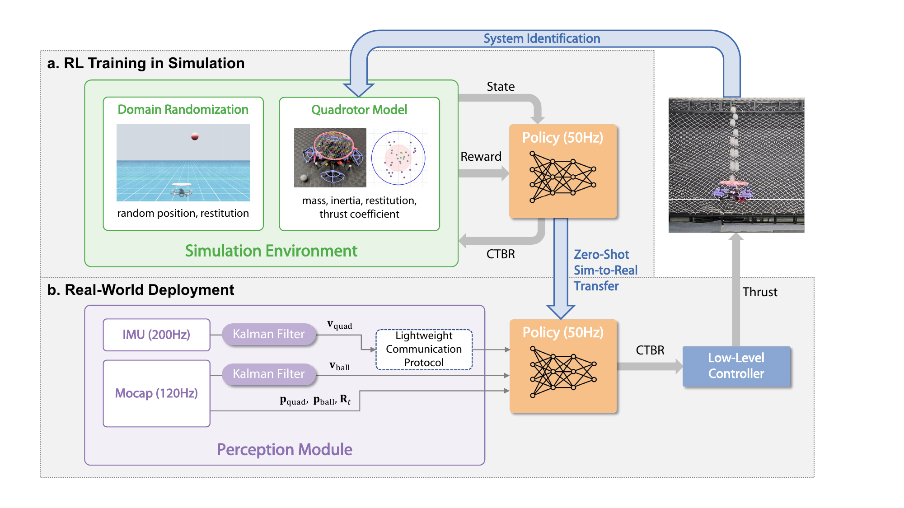

---

# JuggleRL

[](https://docs.omniverse.nvidia.com/app_isaacsim/app_isaacsim/overview.html)
[](https://docs.python.org/3/whatsnew/3.10.html)
[](https://omnidrones.readthedocs.io/en/latest/)
[](https://opensource.org/licenses/MIT)

*JuggleRL_train* is the training and evaluation code for *JuggleRL*, our RL-based aerial ball-juggling system.
It is built on top of *OmniDrones*, an open-source platform for reinforcement-learning research on multi-rotor drones in NVIDIA Isaac Sim. We reuse OmniDrones’ efficient and flexible simulation abstractions and utilities, and add a juggling task, training/evaluation scripts, and experiment configs.

## Option 1: Install Local Version

#### 1. Isaac Sim

Download the [Omniverse Isaac Sim (local version/in the cloud version)](https://developer.nvidia.com/isaac-sim) and install the desired Isaac Sim release following the [official document](https://docs.omniverse.nvidia.com/isaacsim/latest/installation/install_workstation.html). *Note that Omniverse Isaac Sim supports multi-user access, eliminating the need for repeated downloads and installations across different user accounts.*

Set the following environment variables to your ``~/.bashrc`` or ``~/.zshrc`` files :

```
# Isaac Sim root directory
export ISAACSIM_PATH="${HOME}/.local/share/ov/pkg/isaac-sim-*"
```

where ``*`` corresponds to the Isaac Sim version. 

After adding the environment variable, apply the changes by running:
```
source ~/.bashrc
```

#### 2. Conda

Although Isaac Sim comes with a built-in Python environment, we recommend using a seperate conda environment which is more flexible. We provide scripts to automate environment setup when activating/deactivating a conda environment at ``OmniDrones/conda_setup``.

```
conda create -n sim2 python=3.10
conda activate sim2

# at OmniDrones/
cp -r conda_setup/etc $CONDA_PREFIX
# re-activate the environment
conda activate sim2
# install OmniDrones
pip install -e .

# verification
python -c "from omni.isaac.kit import SimulationApp"
# which torch is being used
python -c "import torch; print(torch.__path__)"
```

#### 3. Third Party Packages
OmniDrones requires specific versions of the `tensordict`, `torchrl` and `orbit` packages. For this branch, it supports `tensordict` version 0.4.0+a8c5397, `torchrl` version 0.4.0+aacf134
 and version `orbit` 0.15.9+bca680a. We also manage these three packages using Git submodules to ensure that the correct versions are used. To initialize and update the submodules, follow these steps:

Get the submodules:
```
# at OmniDrones/
git submodule update --init --recursive
```

Install `tensordict`:
```
# at OmniDrones/
cd third_party/tensordict
python setup.py develop
```

Before install `torchrl`, first check and update gcc and g++:
```
# check gcc version, should be like: gcc (Ubuntu 9.4.0-1ubuntu1~20.04.2) 9.4.0 ...
gcc --version

# if not gcc 9.x, check available gcc
ls /usr/bin/gcc*

# if gcc-9 is not installed
sudo apt update && sudo apt install gcc-9
# if gcc-9 is installed
sudo update-alternatives --install /usr/bin/gcc gcc /usr/bin/gcc-9 100
sudo update-alternatives --config gcc
# then follow instructions to select gcc-9.

# check gcc version again
gcc --version

# apply same update and config to g++
```

Then install `torchrl`:
```
# at OmniDrones/
cd third_party/rl
python setup.py develop
```

Also we need to install `orbit` package of Isaac Sim, you can follow the instructions in the [official document](https://isaac-orbit.github.io/orbit/source/setup/installation.html), or simply follow the following steps:
```
# at OmniDrones/
cd third_party/orbit
# create a symbolic link
ln -s ${ISAACSIM_PATH} _isaac_sim

# create environment variable
echo -e "alias orbit=$(pwd)/orbit.sh" >> ${HOME}/.bashrc
source ${HOME}/.bashrc
conda activate sim2

# building extentions
sudo apt install cmake build-essential
./orbit.sh --install  # or "./orbit.sh -i"
```

<!-- We manage these two packages using Git submodules to ensure that the correct versions are used. To initialize and update the submodules, follow these steps:

Get the submodules:
```
# at OmniDrones/
git submodule update --init --recursive
```
Pip install these two packages respectively:
```
# at OmniDrones/
cd third_party/tensordict
pip install -e .
```
```
# at OmniDrones/
cd third_party/torchrl
pip install -e .
``` -->
#### 4. Verification
```
# at OmniDrones/
cd scripts/shell
conda activate sim2
./singlejuggle_sim2real.sh
```

#### 5. Working with VSCode

To enable features like linting and auto-completion with VSCode Python Extension, we need to let the extension recognize the extra paths we added during the setup process.

Create a file ``.vscode/settings.json`` at your workspace if it is not already there.

After activating the conda environment, run

```
printenv > .vscode/.python.env
``````

and edit ``.vscode/settings.json`` as:

```
{
    // ...
    "python.envFile": "${workspaceFolder}/.vscode/.python.env",
}
```
    
## Usage

For usage and more details, please refer to Omnidrones's [documentation](https://omnidrones.readthedocs.io/en/latest/).


## Citation

Please cite [this paper](https://arxiv.org/abs/2509.24892) and [OmniDrones](https://ieeexplore.ieee.org/abstract/document/10409589) if you use *JuggleRL* in your work:

```
@article{ji2025jugglerl,
  title={JuggleRL: Mastering Ball Juggling with a Quadrotor via Deep Reinforcement Learning},
  author={Ji, Shilong and Chen, Yinuo and Wang, Chuqi and Chen, Jiayu and Zhang, Ruize and Gao, Feng and Tang, Wenhao and Yu, Shu'ang and Xiang, Sirui and Chen, Xinlei and others},
  journal={arXiv preprint arXiv:2509.24892},
  year={2025}
}
@article{xu2024omnidrones,
  title={Omnidrones: An efficient and flexible platform for reinforcement learning in drone control},
  author={Xu, Botian and Gao, Feng and Yu, Chao and Zhang, Ruize and Wu, Yi and Wang, Yu},
  journal={IEEE Robotics and Automation Letters},
  volume={9},
  number={3},
  pages={2838--2844},
  year={2024},
  publisher={IEEE}
}
```

## Ackowledgement

Some of the abstractions and implementation was heavily inspired by [Isaac Orbit](https://github.com/NVIDIA-Omniverse/Orbit) and [OmniDrones](https://github.com/btx0424/OmniDrones).
