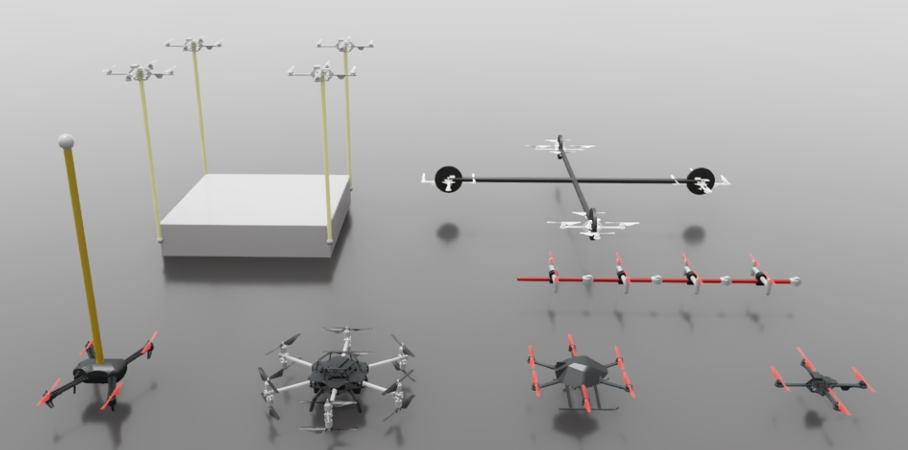

---

# OmniDrones

[](https://docs.omniverse.nvidia.com/app_isaacsim/app_isaacsim/overview.html)
[](https://docs.python.org/3/whatsnew/3.10.html)
[](https://omnidrones.readthedocs.io/en/latest/)
[](https://opensource.org/licenses/MIT)


*OmniDrones* is an open-source platform designed for reinforcement learning research on multi-rotor drone systems. Built on [Nvidia Isaac Sim](https://docs.omniverse.nvidia.com/app_isaacsim/app_isaacsim/overview.html), *OmniDrones* features highly efficient and flxeible simulation that can be adopted for various research purposes. We also provide a suite of benchmark tasks and algorithm baselines to provide preliminary results for subsequent works.


## Option 1: Install Local Version

#### 1. Isaac Sim

Download the [Omniverse Isaac Sim (local version/in the cloud version)](https://developer.nvidia.com/isaac-sim) and install the desired Isaac Sim release following the [official document](https://docs.omniverse.nvidia.com/isaacsim/latest/installation/install_workstation.html). *Note that Omniverse Isaac Sim supports multi-user access, eliminating the need for repeated downloads and installations across different user accounts.*

Set the following environment variables to your ``~/.bashrc`` or ``~/.zshrc`` files :

```
# Isaac Sim root directory
export ISAACSIM_PATH="${HOME}/.local/share/ov/pkg/isaac-sim-*"
```

where ``*`` corresponds to the Isaac Sim version. 

After adding the environment variable, apply the changes by running:
```
source ~/.bashrc
```

#### 2. Conda

Although Isaac Sim comes with a built-in Python environment, we recommend using a seperate conda environment which is more flexible. We provide scripts to automate environment setup when activating/deactivating a conda environment at ``OmniDrones/conda_setup``.

```
conda create -n sim2 python=3.10
conda activate sim2

# at OmniDrones/
cp -r conda_setup/etc $CONDA_PREFIX
# re-activate the environment
conda activate sim2
# install OmniDrones
pip install -e .

# verification
python -c "from omni.isaac.kit import SimulationApp"
# which torch is being used
python -c "import torch; print(torch.__path__)"
```

#### 3. Third Party Packages
OmniDrones requires specific versions of the `tensordict`, `torchrl` and `orbit` packages. For this branch, it supports `tensordict` version 0.4.0+a8c5397, `torchrl` version 0.4.0+aacf134
 and version `orbit` 0.15.9+bca680a. We also manage these three packages using Git submodules to ensure that the correct versions are used. To initialize and update the submodules, follow these steps:

Get the submodules:
```
# at OmniDrones/
git submodule update --init --recursive
```

Install `tensordict`:
```
# at OmniDrones/
cd third_party/tensordict
python setup.py develop
```

Before install `torchrl`, first check and update gcc and g++:
```
# check gcc version, should be like: gcc (Ubuntu 9.4.0-1ubuntu1~20.04.2) 9.4.0 ...
gcc --version

# if not gcc 9.x, check available gcc
ls /usr/bin/gcc*

# if gcc-9 is not installed
sudo apt update && sudo apt install gcc-9
# if gcc-9 is installed
sudo update-alternatives --install /usr/bin/gcc gcc /usr/bin/gcc-9 100
sudo update-alternatives --config gcc
# then follow instructions to select gcc-9.

# check gcc version again
gcc --version

# apply same update and config to g++
```

Then install `torchrl`:
```
# at OmniDrones/
cd third_party/rl
python setup.py develop
```

Also we need to install `orbit` package of Isaac Sim, you can follow the instructions in the [official document](https://isaac-orbit.github.io/orbit/source/setup/installation.html), or simply follow the following steps:
```
# at OmniDrones/
cd third_party/orbit
# create a symbolic link
ln -s ${ISAACSIM_PATH} _isaac_sim

# create environment variable
echo -e "alias orbit=$(pwd)/orbit.sh" >> ${HOME}/.bashrc
source ${HOME}/.bashrc

# building extentions
sudo apt install cmake build-essential
./orbit.sh --install  # or "./orbit.sh -i"
```

<!-- We manage these two packages using Git submodules to ensure that the correct versions are used. To initialize and update the submodules, follow these steps:

Get the submodules:
```
# at OmniDrones/
git submodule update --init --recursive
```
Pip install these two packages respectively:
```
# at OmniDrones/
cd third_party/tensordict
pip install -e .
```
```
# at OmniDrones/
cd third_party/torchrl
pip install -e .
``` -->
#### 4. Verification
```
# at OmniDrones/
cd scripts
python train.py headless=true wandb.mode=disabled
```

#### 5. Working with VSCode

To enable features like linting and auto-completion with VSCode Python Extension, we need to let the extension recognize the extra paths we added during the setup process.

Create a file ``.vscode/settings.json`` at your workspace if it is not already there.

After activating the conda environment, run

```
printenv > .vscode/.python.env
``````

and edit ``.vscode/settings.json`` as:

```
{
    // ...
    "python.envFile": "${workspaceFolder}/.vscode/.python.env",
}
```

## Option 2: Install Container Version (using Docker)
The Container version is easier to set up compared to the Local version. However, it's important to note that the Container version does not support real-time rendering. Therefore, it only supports the command with ``headless=true``. You can save videos during training and upload them to Wandb. 

First, make sure your computer has installed ``Docker``, ``NVIDIA Driver`` and ``NVIDIA Container Toolkit``. Then, you should successfully run: 

```
# Verification
docker run --rm --runtime=nvidia --gpus all ubuntu nvidia-smi
```

Download the image from Docker Hub:
```
docker pull jimmyzhangruize/isaac-sim:2023.1.0-hotfix.1
```
This image already includes Isaac sim, so you don't neet to download Isaac sim. However, you need to clone the OmniDrones repository to your local computer because we use OmniDrones mounted in the container.

Then, run the image:
```
docker run --name *** --entrypoint bash -dit --gpus all -e "ACCEPT_EULA=Y" --rm --network=host \
-e "PRIVACY_CONSENT=Y" \
-v ~/docker/isaac-sim/cache/kit:/isaac-sim/kit/cache:rw \
-v ~/docker/isaac-sim/cache/ov:/root/.cache/ov:rw \
-v ~/docker/isaac-sim/cache/pip:/root/.cache/pip:rw \
-v ~/docker/isaac-sim/cache/glcache:/root/.cache/nvidia/GLCache:rw \
-v ~/docker/isaac-sim/cache/computecache:/root/.nv/ComputeCache:rw \
-v ~/docker/isaac-sim/logs:/root/.nvidia-omniverse/logs:rw \
-v ~/docker/isaac-sim/data:/root/.local/share/ov/data:rw \
-v ~/docker/isaac-sim/documents:/root/Documents:rw \
-v ***:/root/OmniDrones:rw \
-v /data:/data \
-e "WANDB_API_KEY=***" \
jimmyzhangruize/isaac-sim:2023.1.0-hotfix.1
```

Note that:
1. You need to replace *** in ```--name ***``` with the your docker image name.
1. You need to replace *** in ```-v ***:/root/OmniDrones:rw``` with the directory where OmniDrones is locally located in.
2. You need to replace *** in ```-e "WANDB_API_KEY=***"``` with your own WANDB_API_KEY. If you do not need to use Wandb, you can omit this line.
3. In the container, OmniDrones is located at ``/root/OmniDrones`` and Isaac-sim is located at ``/isaac-sim``.


Install OmniDrones in the container:
```
conda activate sim23
cd /root/OmniDrones
cp -r conda_setup/etc $CONDA_PREFIX
conda activate sim23 # re-activate the environment
pip install -e . # install OmniDrones
```

Verify you can successfully run OmniDrones in the container (use ``deploy`` branch):

```
cd /root/OmniDrones/scripts
python train.py headless=true wandb.mode=disabled total_frames=50000 task=Hover
```

    
## Usage

For usage and more details, please refer to the [documentation](https://omnidrones.readthedocs.io/en/latest/).


## Citation

Please cite [this paper](https://arxiv.org/abs/2309.12825) if you use *OmniDrones* in your work:

```
@misc{xu2023omnidrones,
    title={OmniDrones: An Efficient and Flexible Platform for Reinforcement Learning in Drone Control}, 
    author={Botian Xu and Feng Gao and Chao Yu and Ruize Zhang and Yi Wu and Yu Wang},
    year={2023},
    eprint={2309.12825},
    archivePrefix={arXiv},
    primaryClass={cs.RO}
}
```

## Ackowledgement

Some of the abstractions and implementation was heavily inspired by [Isaac Orbit](https://github.com/NVIDIA-Omniverse/Orbit).
